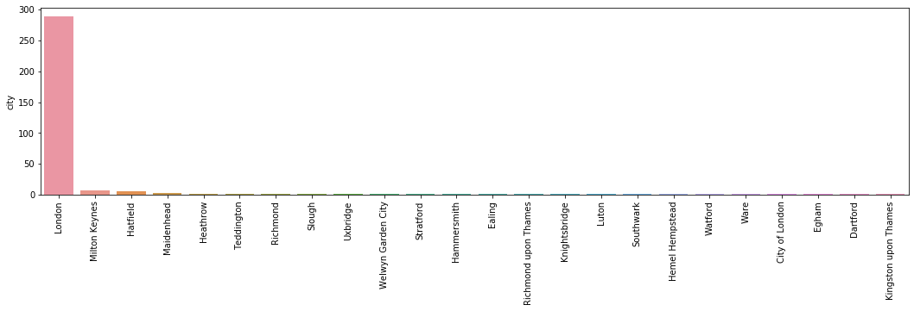
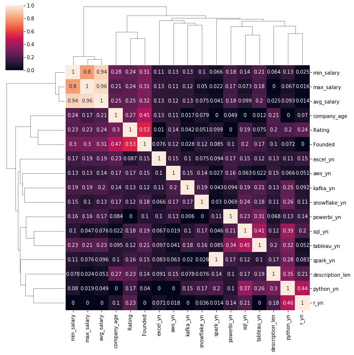
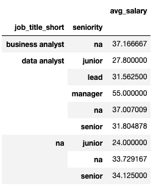

# Data Analyst Salary Estimation Project
- Created Data Analyst salary estimation tool (MAE ~ £7K) to help data analysts negotiate their income.
- Scraped 360 job postings from glasdoor using python and selenium.
- Engineered features from text to define what skills companies put their value on (sql, python, excel,tableau, powerbi, aws, etc.) 
- Optimized Linear and Random Forest Regressors using GridSearchCV to find the best model.
- Created a client facing API using flask.

## Code and Resources

- Python Version 3.7
- Packages: pandas, numpy, matplotlib, seaborn, selenium, sklearn, flask, json, pickle
- Scraper Article: https://towardsdatascience.com/selenium-tutorial-scraping-glassdoor-com-in-10-minutes-3d0915c6d905
- Flask Productionization Article: https://towardsdatascience.com/productionize-a-machine-learning-model-with-flask-and-heroku-8201260503d2

## Web Scraping
Adjusted the web scraper code to collect the following information about 360 job postings available in London.
  - Job Title
  - Salary Estimate
  - Job Description
  - Rating
  - Company Name
  - Location
  - Size
  - Founded
  - Type of ownership
  - Industry
  - Sector
  - Revenue
  
## Data Cleaning

Cleaned the data to use for my model. The following changes have been made:

 - Removed rows without salary, duplicates, and Unnamed column
 - Cleaned job title (Data Analyst, BI Analyst, etc.)
 - Parced job title seniority expertise (Junior, Senior, etc.)
 - Parced job title domain expertise (Product, Finance etc.)
 - Parced min, max, avg salary
 - Created columns for different skills listed in job description:
   - sql
   - python
   - r studio
   - spark
   - aws
   - excel
   - powerbi
   - tableau
   - kafka
   - snowflake
- Column for description length

## Exploratory Data Analysis

